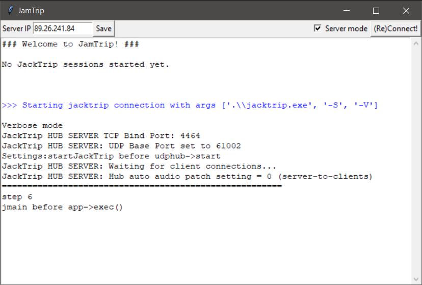

# JamTrip

This project makes it easier to jam with your friends using JackTrip.

# Installation

Download the latest [JamTrip.zip](https://github.com/AlbertoEAF/JamTrip/archive/refs/heads/master.zip) and extract it to a folder of your choosing.

Then, follow the [jacktrip installation instructions](https://ccrma.stanford.edu/software/jacktrip/windows/index.html) to:
1. Install ASIO4ALL - only needed if you'll use your PC internal sound interface (unlikely)
2. Install JACK
3. Download jacktrip to the JamTrip folder

# Configuration

Set your JACK settings to match the jacktrip server settings, namely:
- **sample rate** 
- **frames per buffer**

# Usage

Steps:
1. Start Jack
2. Double-click **client.py** 
3. Specify the server IP and press **(Re)Connect!**

Tip: You can save the server IP address by pressing the **Save** button for future sessions.

# How to host a server yourself

If you are hosting the server, tick the **Server mode** checkbox and you don't need to specify the IP.

Notice that you will likely need to port-forward the UDP ports 4464 and 61000-61050.